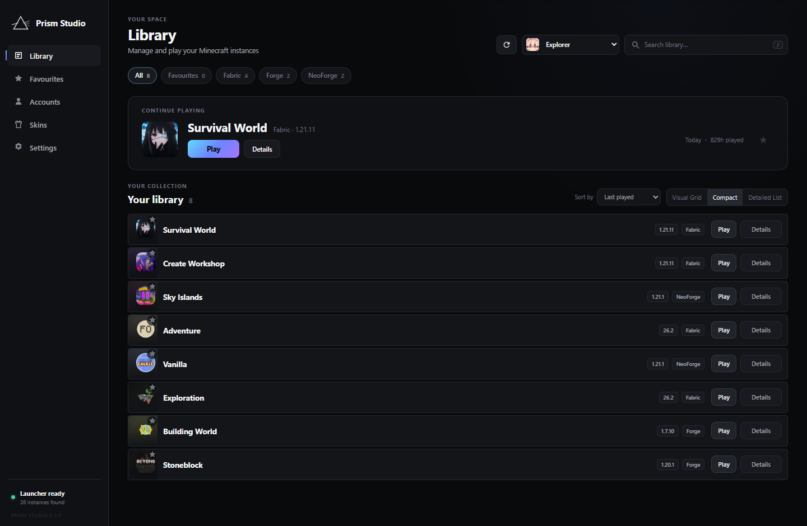
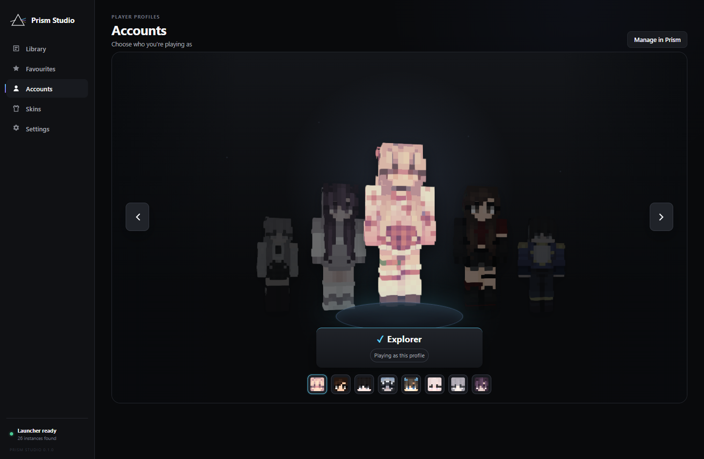
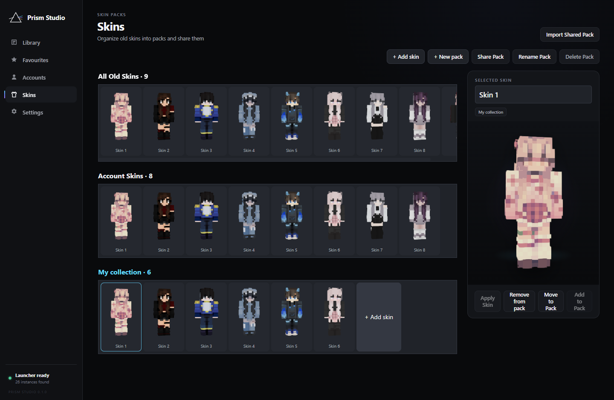
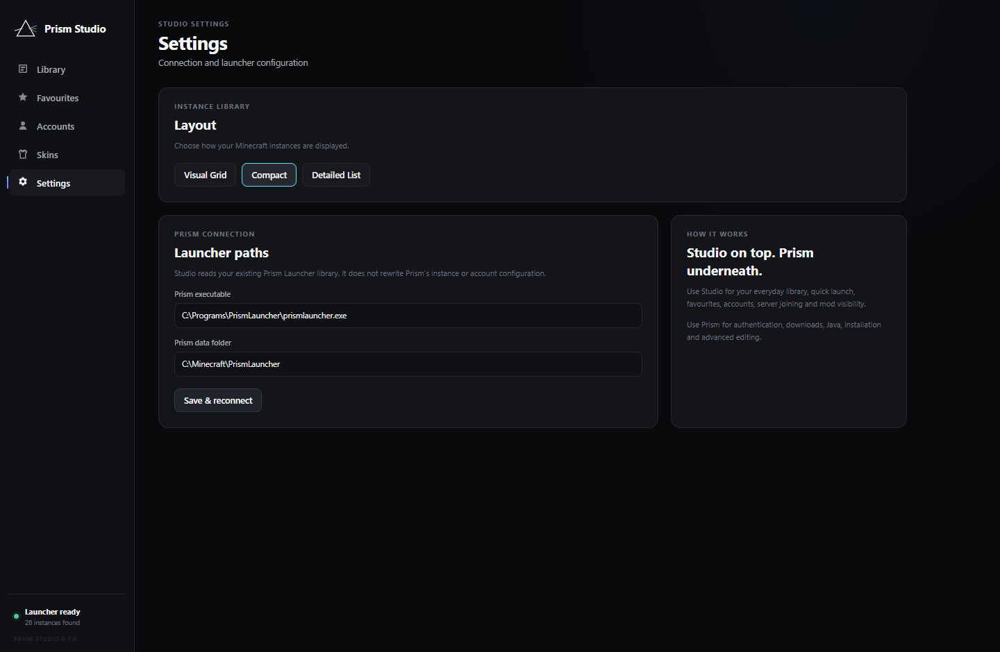

# Prism Studio

A polished Windows frontend for your existing Prism Launcher library.

Browse instances, choose a launch profile, and organize local Minecraft skins. Prism handles authentication, downloads, Java, mod loaders, installing instances, and advanced editing. This is an independent project, not an official Prism Launcher release.

## Install

Requirements: Windows 10/11 (64-bit), Prism Launcher, and a Minecraft account configured in Prism. The installer can download Microsoft WebView2 if needed.

1. Open [GitHub Releases](https://github.com/KiraDiamond/Prism-Studio/releases).
2. Download the Windows Prism Studio x64 setup executable when a release is available.
3. Run it, then open **Prism Studio** from Start.

Builds are unsigned, so Windows may show a publisher warning. Download only from this project's releases. If no installer is published yet, use the developer instructions below. Node.js and Rust are not required to use the installed application.

## Updating an existing EXE

In this version, open **Settings → Check for updates**. Studio checks the latest stable GitHub release, asks before updating, verifies the executable's SHA-256 digest and product/version, then closes and reopens the app. The previous executable is retained beside it as a `.bak` file. Settings and packs are not replaced.

For older EXE builds without that button, download **Prism-Studio-Updater.zip** from [Releases](https://github.com/KiraDiamond/Prism-Studio/releases/latest), extract both files, and run **Update-Prism-Studio.cmd**. Select your existing Prism Studio EXE if asked. You only need this standalone step once. Updating requires write access to the EXE's directory. GitHub download verification is not Windows code signing; builds remain unsigned.

Release maintainers must publish a stable `vMAJOR.MINOR.PATCH` release with a `Prism-Studio.exe` asset matching its version, and include `Prism-Studio-Updater.zip`. The updater rejects incomplete releases or downloads without GitHub's SHA-256 digest.

## First launch

Studio checks the usual Prism executable and data locations. If your library does not appear, open **Settings**, enter the path to prismlauncher.exe and your Prism data directory, then choose **Save & reconnect**. Portable installations work with their own executable and data directory.

Sign in and create instances through Prism. Refresh Studio after changing your library or accounts there. Studio reads the library and launches through Prism's command-line interface; Prism may display its own windows.

## Features

- Instance and group search, loader filters, sorting and saved favourites.
- Visual Grid, Compact and Detailed List share one saved preference between Settings and the toolbar.
- Continue Playing and a side inspector with metadata, installed mods, optional server address, and Prism/folder actions.
- Account carousel: arrows and head thumbnails browse. Click the centered character, press Enter, or choose **Use this profile** to select it for launch.
- Press / to search and Escape to close details. Controls support keyboard focus.

## Skins and packs

Create a pack, then **Add skin** to import original 64x64 or legacy 64x32 PNGs, up to 1 MB each. Imported skins receive names such as **Skin 1**. Edit the selected skin's name to rename it. Custom packs support rename, delete, copy/move membership, removal, sharing and shared-pack import.

**All Old Skins** permanently archives textures Studio has observed or imported. **Account Skins** represents current cached Prism skins. Studio cannot recover skins it never observed and Prism no longer has. Deleting a custom pack preserves archived textures.

Original PNGs are content-deduplicated under %APPDATA%\PrismStudio\skins. Packs reference shared skin IDs. Shared packs include original textures, names and default/slim models; previews are generated locally. Back up the entire skins directory. library.bak retains the previous metadata save; legacy migration data is retained separately when present.

**Apply Skin** changes the selected account's Minecraft Java skin. Select a skin, click Apply Skin, check the account shown, choose Classic or Slim arms, and confirm. Studio uploads the original PNG directly to Minecraft over HTTPS. Rejoin your world/server to see the change. Offline accounts cannot upload skins. If the session has expired, refresh or sign in to that account in Prism and retry. Prism's cached preview may remain old until Prism refreshes it.

## Settings and privacy

No telemetry, advertising, cloud account, local HTTP server or remote avatar service. Authentication tokens are not exposed to the frontend. Prism handles authentication. Skins stay local unless you share an exported pack or confirm Apply Skin, which sends the original PNG to Minecraft's official service using the selected account's saved Minecraft session in Rust. Studio neither logs tokens nor rewrites Prism's account file.

Studio does not rewrite Prism account or instance configuration. Connection settings and layout live under %APPDATA%\PrismStudio. Lightweight choices such as favourites, server addresses and profile selection use local WebView storage. Original skin textures live on disk, not indefinitely as browser base64 data.

## Limitations

- Pre-1.0 Windows release tested on one development machine, not every Windows PC.
- Apply Skin needs a valid online Minecraft session from Prism; Studio does not refresh Microsoft authentication itself.
- A successful Play handoff means the Prism process started, not that Minecraft finished launching.
- Installer signing and automatic release publishing are not configured.
- Screenshots use demonstration data.

## Build from source

Requires Windows, current stable Rust (1.89 or newer), Visual Studio C++ Build Tools and Windows SDK, Node.js 22 or newer, and WebView2. Prism is required for integration testing.

    git clone https://github.com/KiraDiamond/Prism-Studio.git
    cd Prism-Studio
    npm ci
    npm run check
    cargo test --manifest-path src-tauri/Cargo.toml
    npm run build:ui
    npm run build

Installer output: src-tauri/target/release/bundle/nsis/.
Executable: src-tauri/target/release/prism-studio.exe.
If CARGO_TARGET_DIR is set, use that target directory instead.

npm run build:portable produces a release executable without an installer; WebView2 must already be installed. npm run tauri dev starts development mode.

Architecture: Rust + Tauri 2 + WebView2 + static HTML/CSS/JavaScript. Node/esbuild are build tools only. The checked-in renderer bundle is rebuilt from skinview-entry.js. Windows CI checks, tests and builds the installer without signing or publishing it.

See [VALIDATION.md](VALIDATION.md) for the test record.

## License

The owner has not selected an explicit project license. Do not assume an MIT/GPL or other redistribution grant for Prism Studio itself. Dependency licenses are separate: see [THIRD-PARTY-NOTICES.txt](THIRD-PARTY-NOTICES.txt), including skinview3d and three.js notices.
